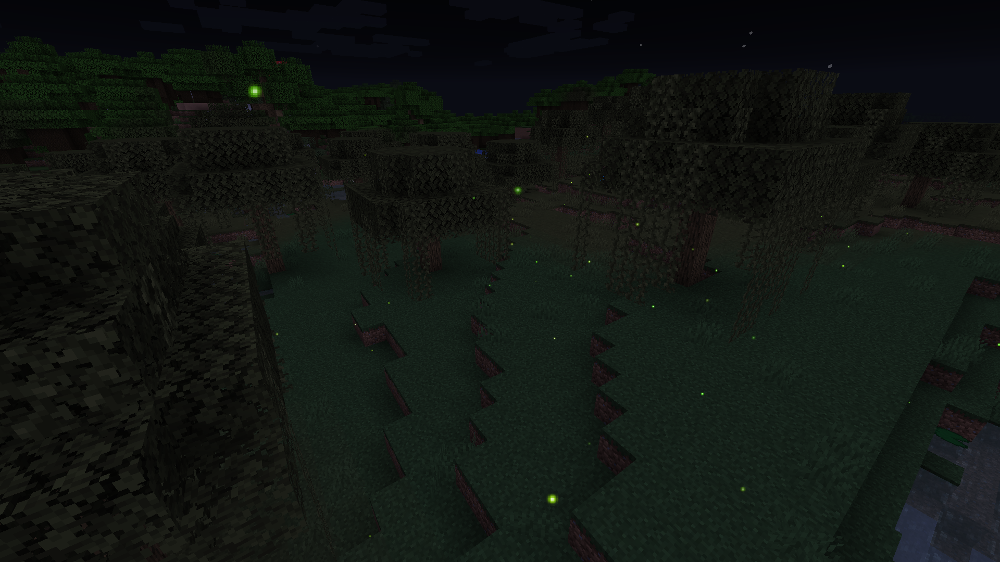
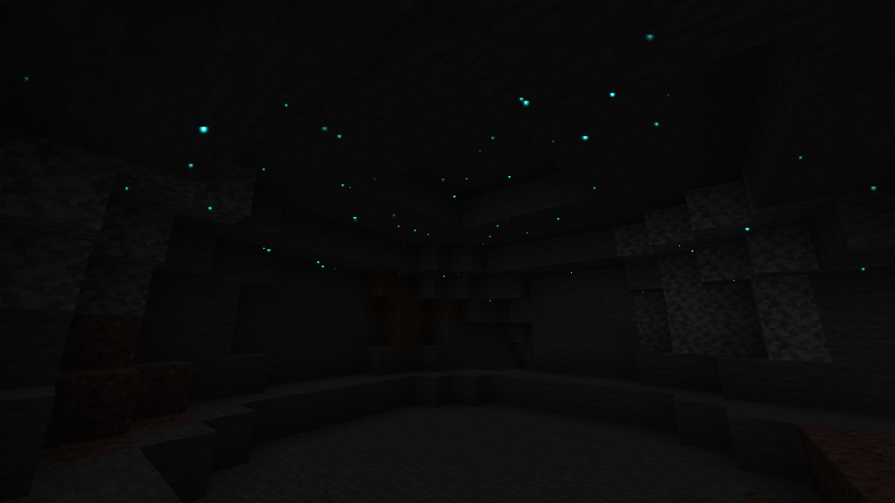
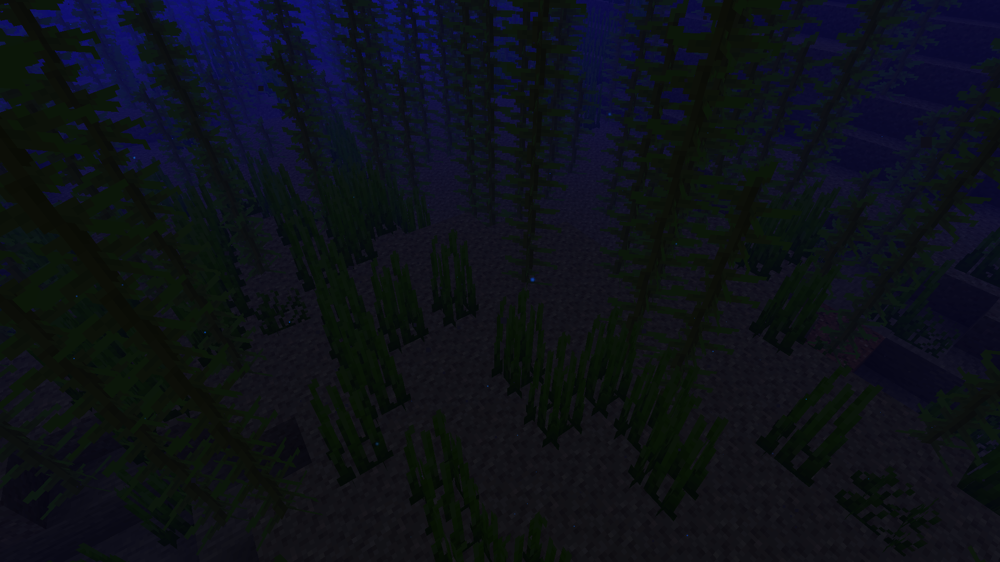
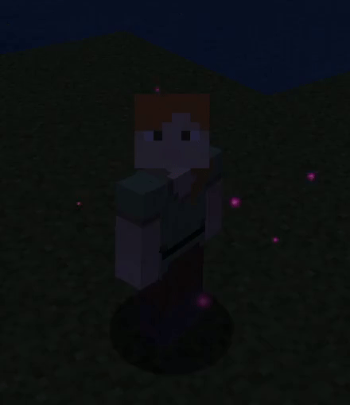

# Illuminations

**Illuminations** is a client sided Minecraft Fabric mod that adds multiple ambient particles in order to make your world more enjoyable at night or in dark places.

## Illuminations types

### Fireflies

**Fireflies** are small flying insects that come out during the night and disappear when the sun rises. They will appear in small quantities in jungle, plains, savanna and taiga type biomes, medium quantities in forest and river type biomes and great quantity in swamp type biomes.

### Glowworms

**Glowworms** are small larvae living in caves by sticking to the ceiling that will fall down if their support block is removed. They will appear in small quantities in jungle, plains, savanna and taiga type biomes, medium quantities in forest and river type biomes and great quantity in swamp type biomes.

### Plankton

Glowing **plankton** - even though difficult to notice because of its size - can be found floating around in the dark parts of the oceanic depths. They appear in any ocean biome as long as the light is sufficiently low.

## Auras

**Auras** are special Illuminations effects around the player visible to other players that have the mod. Auras currently serve as a bonus for donators that support the mod and are purely cosmetic with no other provided advantage whatsoever. They are visible to other players with Illuminations installed (even on vanilla servers).

Two types of aura are currently availably: regular auras and prismatic auras. Regular auras are not customizable and have a specific color that you cannot change, while prismatic auras on the other hand will be colored depending on your Illuminations prismatic color.

Auras and prismatic color can be selected and changed via the [Illuminations dashboard](https://illuminations.glitch.me/).

### Twilight aura (prismatic)

The **Twilight** aura creates prismatic colored fireflies that will orbit around the player. If the player moves, they will leave a trail of these fireflies.

## FAQ

#### Can I include this mod in a modpack?

**Yes**: You can. Go ahead, don't bother asking. Please however provide credit and a link to either the GitHub repository or Curse Forge project page.

#### Can I use this mod on a vanilla server?

**Yes**: If you have installed this mod on your Minecraft client, you will be able to connect to vanilla Minecraft servers and the ambient illuminations will work as intended.

#### Are auras visible to other players?

**Yes**: If the player has the mod installed on their client, your aura will be visible to them, just like their aura will be visible to you if they possess one.

#### How to get an aura?

**Auras are currently only available to donators**, if they have donated more than 1$.

#### I wish to support the mod and get an aura. What steps do I need to follow?

In order to get an aura, you will need to make a PayPal donation by following [this link](https://www.paypal.com/cgi-bin/webscr?cmd=_s-xclick&hosted_button_id=B6H4NEF43GM2S&source=url) or via the Curse Forge donate button available on the project page. **When making your donation, please include your Minecraft UUID as well as a valid email address (so I may contact you in case of any problem) in your message.** All donations and aura attributions are manually processed and done as soon as possible, but may take up to a day so please be patient.

#### I want to change my aura / the color of my prismatic auras / disable it, what do I do?

If you have donated multiple times, you may have multiple auras and may want to select a specific one. Or you may just simply want to change your prismatic color or disable your aura. **You can do all this via the [Illuminations dashboard](https://illuminations.glitch.me/)** with no restrictions whatsoever.
