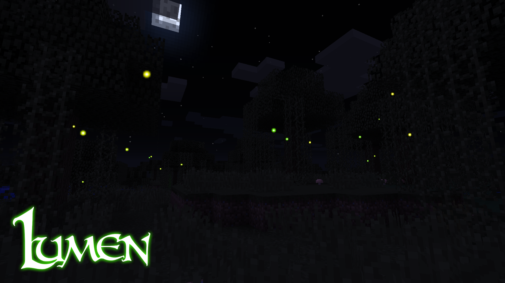
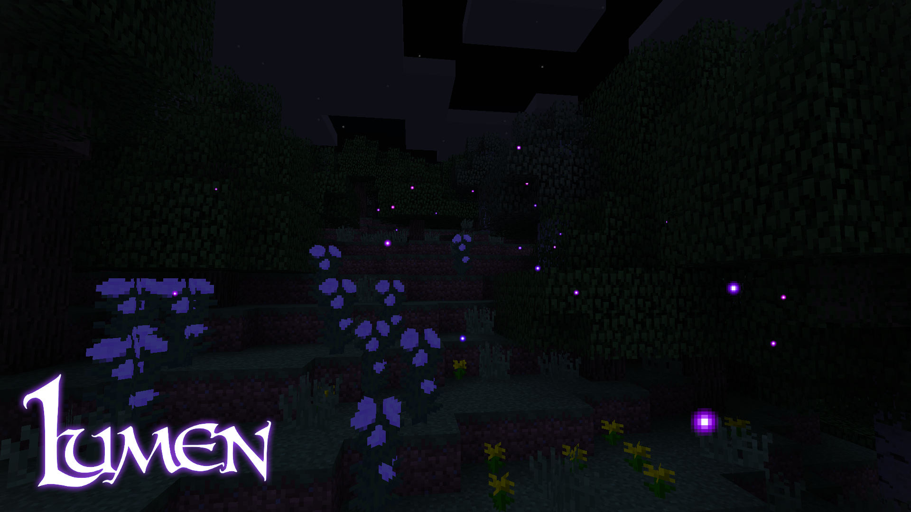
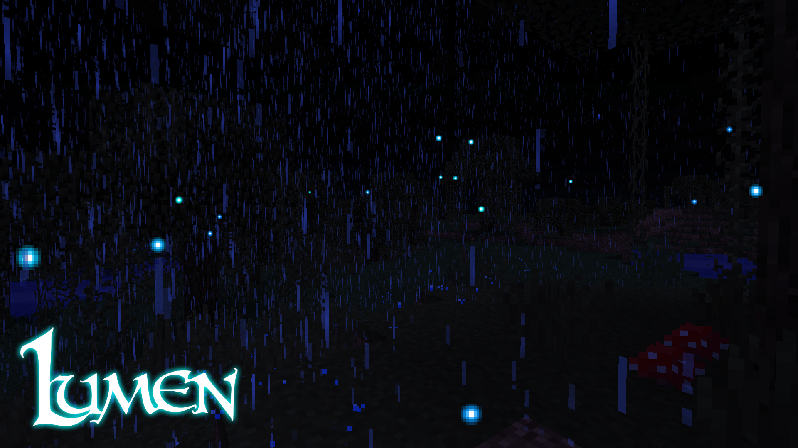
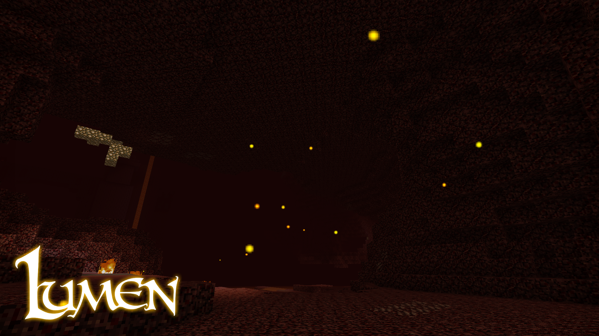
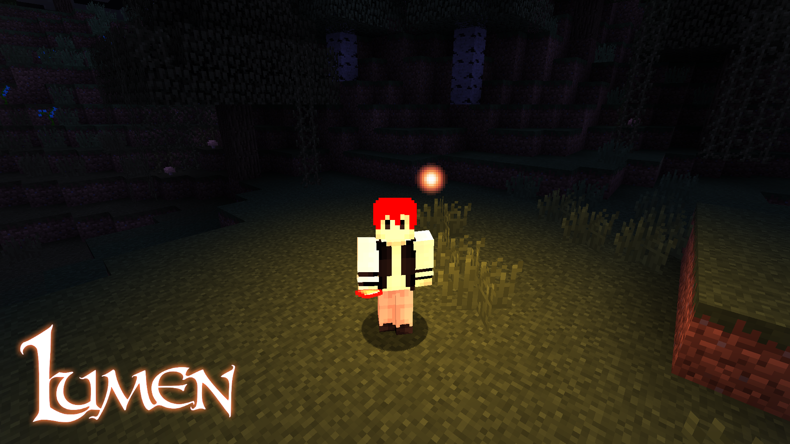
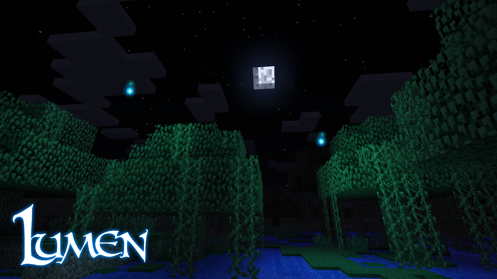
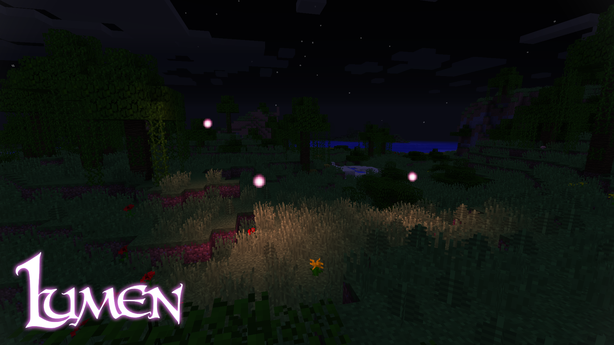

### What is Lumen?

Lumen is a Minecraft mod that adds various glowing ambient entities to your world in order to implement more detail and prettify your nights, along with adding a slight magical touch to your surroundings.

Lumen also adds companion orbs, flying light orbs that will follow you around and light up areas for you.

### Downloads

Currently, the mod files are available solely on the mod's [Curse Forge project page](https://minecraft.curseforge.com/projects/lumen). Please do not download the mod from any other sources under any circumstances, as it can contain some viruses or may likely be an outdated version.

### Credits

Thanks to JannisX11 for making Blockbench! [Check it out](https://blockbench.net/).

Thanks to [Pyrofab](https://minecraft.curseforge.com/members/Pyrofab) for the original code and his constant support. Couldn't do it without you mate!

### Translations

The mod is currently translated into the following languages:

- 🇫🇷 French (thanks to ImmortalPharaoh)

- 🇷🇺 Russian (thanks to V972)
- 🇺🇦 Ukrainian (thanks to V972)
- 🇨🇳 Chinese (thanks to melt)
- 🇪🇸 Spanish (thanks to Xesar_Zk)
- 🇲🇽 Mexican (thanks to Xesar_Zk)

### I want to showcase / use this mod in a video / article, can I do it?

Yes! Of course you can! However, you have a few things to respect if doing so:

- The file download has to be through this Curse Forge project page. **Under no circumstances** are you allowed to re-host the mod files.
- You are **NOT** allowed, under any means, to put the link to this page through an ad wall site (like Ad.fly for example).
- You have, of course, no right to take credit for the mod.

### Support and suggestions

If you have any ideas on how you would like to see the mod improve, please either submit an issue on this GitHub repo, leave a comment on Curse Forge or join our Discord and discuss about it with us.

If you have any problem with the mod, please ask for help on our Discord. If you encounter what you think is a bug, please submit an issue on this repository.

### Discord

[You can join our Discord server if you want to submit ideas, request help or just chat with us!](https://ladysnake.glitch.me/discord)

### Gallery

